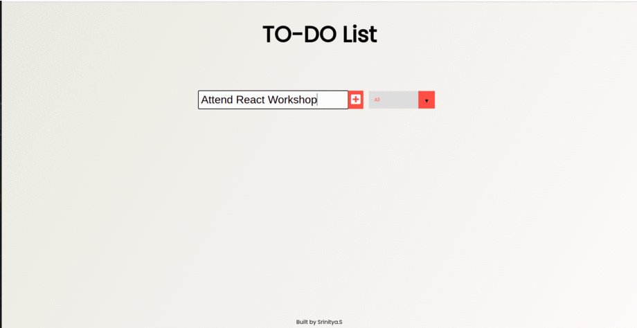

# To-Do App

To-do App mantains day-to-day tasks. One can create new tasks, delete previous tasks on this app and keep track of all the complete and incomplete tasks with this app.
This project is the result of the hands-on learning series on React from the youtube channel [Dev Ed](https://www.youtube.com/watch?v=pCA4qpQDZD8)

# Technologies

React : To create new tasks and sort completed/incompleted tasks. 

# Screenshots



# To run
```bash
npm start
```
Runs the app in the development mode.
Open http://localhost:3000 to view it in the browser.

# Future Work

* Sets clock-reminder to accomplish tasks 
* Marks important event dates on Google Calender
* Isolates tasks beased on activity.
* Sets deadline for each task to be accomplished.

# References

* [To-do React](https://www.youtube.com/watch?v=pCA4qpQDZD8)